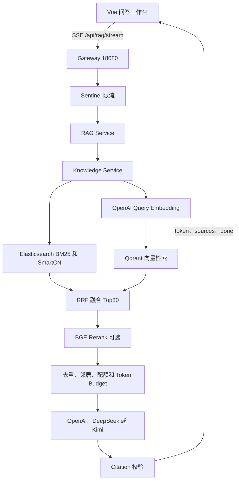
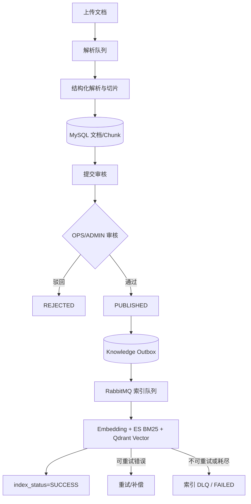
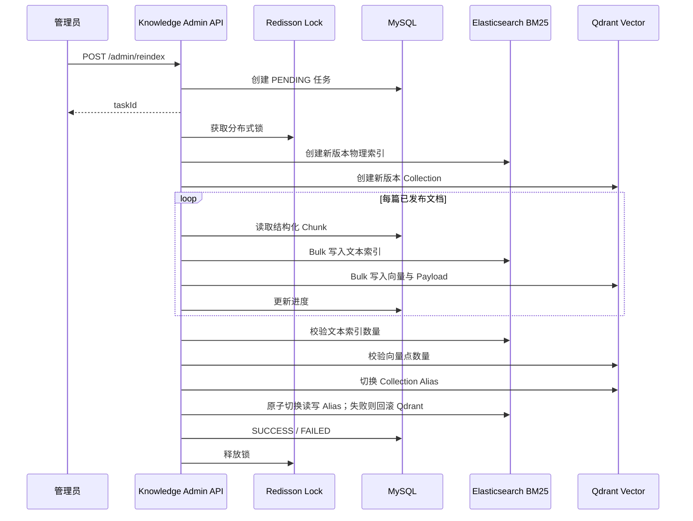

# OpsAgent RAG 架构与运行机制

## 在线问答

Embedding 或向量检索失败时 Knowledge Service 降级为 BM25；BGE 不可用或超过配置超时时保持 RRF 顺序；LLM 不可用时返回检索证据。降级会记录指标和结构化元数据。代码默认 Top30/3 秒，本机 CPU 启动脚本采用 5 候选/20 秒；有 GPU 或独立推理服务时应压测后恢复更大的候选池。

## 文档入库与索引一致性

发布状态 `review_status` 与技术索引状态 `index_status` 分离。RAG 只能检索已发布并且当前用户有权访问的文档。删除和归档写入 DELETE 补偿任务，避免 ES 残留可检索内容。

## Reindex

管理入口为前端“知识索引管理”，后端接口统一位于 `/api/knowledge/admin`。旧 `/internal/reindex` 仅保留兼容，不应作为新运维流程入口。

## 数据与安全

- 问题日志只记录不可逆 query hash、模式、数量、耗时和降级原因，不记录问题正文、Prompt、Context 或 API Key。
- API Key 通过不提交 Git 的 Compose `.env`、Docker Secret 或宿主机 Shell 环境注入容器，不进入镜像层、Nacos、数据库和前端。
- Embedding 授权与生成模型授权是两个不同的数据处理目的；新增知识应在数据分级确认后再外发。
- Citation 来源由后端检索结果构造，模型不能自行扩充来源编号。
